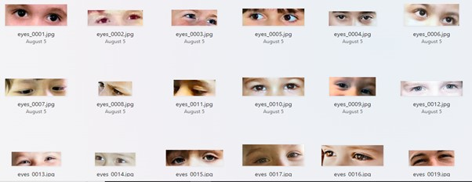

# AUTISM PROJECT
Predicting Onset of Autism in Kids using Face Segments

## DATA.
- For this project, I got photos of kids from an Autism Dataset (Autism-Image—Dataset) that is available on Kaggle. Most of the children in the sample were between the ages of two and eight, while their ages ranged from two to fourteen. The pictures were all in JPEG format and were typical 2D RGB color pictures. There were 2,940 photographs of children in this dataset, divided into two categories with 1,470 being diagnosed with autism and the other 1,470 free of autism.
 

## DATA PREPARATION.

### MEDIAPIPE.
 - Using the Mediapipe, i created a face-mesh landmarks shown in the image below.
```python

!pip install mediapipe opencv-python
from google.colab.patches import cv2_imshow
import cv2
import mediapipe as mp

# Initialize MediaPipe Face Mesh
mp_face_mesh = mp.solutions.face_mesh
face_mesh = mp_face_mesh.FaceMesh(static_image_mode=True, max_num_faces=1, min_detection_confidence=0.5)
```
```

# Load the image
image_path = "/content/This-paper-introduces-MaskFaceGAN-a-novel-approach-to-face-attribute-editing-capable-of.png"
image = cv2.imread(image_path)
rgb_image = cv2.cvtColor(image, cv2.COLOR_BGR2RGB)

# Perform facial landmark detection
results = face_mesh.process(rgb_image)
```
```
if results.multi_face_landmarks:
    for face_landmarks in results.multi_face_landmarks:
        # Draw landmarks on the image
        for idx, landmark in enumerate(face_landmarks.landmark):
            x = int(landmark.x * image.shape[1])
            y = int(landmark.y * image.shape[0])
            # Draw a small circle at each landmark position
            cv2.circle(image, (x, y), 1, (0, 255, 0), -1)
            # Optionally, put the landmark index number
            cv2.putText(image, str(idx), (x, y), cv2.FONT_HERSHEY_SIMPLEX, 0.3, (255, 0, 0), 1, cv2.LINE_AA)
```
```
    # Save the image with landmarks
    cv2.imwrite("output_image_with_landmarks.jpg", image)
```


### FACE SEGMENT EXTRACTION.
```
!pip install mediapipe opencv-python
import cv2
import mediapipe as mp
import numpy as np
import os
```
```
# Initialize MediaPipe Face Mesh
mp_face_mesh = mp.solutions.face_mesh
face_mesh = mp_face_mesh.FaceMesh(static_image_mode=True, max_num_faces=1, min_detection_confidence=0.5)
# Define the input and output folders
input_folder = "/content/drive/MyDrive/AutismDataset/consolidated/Autistic"
output_folder = "/content/drive/MyDrive/faceext/eyes/autistic"

# Create the output folder if it doesn't exist
if not os.path.exists(output_folder):
    os.makedirs(output_folder)
# Function to get bounding box for a set of points
def get_bounding_box(points, image_shape):
    x_coords = [p[0] for p in points]
    y_coords = [p[1] for p in points]
    x_min = max(0, min(x_coords))
    y_min = max(0, min(y_coords))
    x_max = min(image_shape[1], max(x_coords))
    y_max = min(image_shape[0], max(y_coords))
    return x_min, y_min, x_max - x_min, y_max - y_min
```
```
# Iterate over each image in the input folder
for filename in os.listdir(input_folder):
    if filename.endswith(".jpg") or filename.endswith(".png"):
        image_path = os.path.join(input_folder, filename)

        # Load the image
        image = cv2.imread(image_path)
        rgb_image = cv2.cvtColor(image, cv2.COLOR_BGR2RGB)

        # Perform facial landmark detection
        results = face_mesh.process(rgb_image)

        if results.multi_face_landmarks:
            for face_landmarks in results.multi_face_landmarks:
                # Define landmarks for the upper part of the face (eyebrows and forehead)
                # You can adjust these indices based on the specific area you want to crop
                upper_face_indices = [139,230,195,450,383,282,9,53]
                upper_face_points = [(int(face_landmarks.landmark[idx].x * image.shape[1]), int(face_landmarks.landmark[idx].y * image.shape[0])) for idx in upper_face_indices]

                # Get bounding box for the upper face points
                bbox = get_bounding_box(upper_face_points, image.shape)
                x_min, y_min, width, height = bbox

                # Ensure bounding box is within image dimensions
                if x_min < 0 or y_min < 0 or x_min + width > image.shape[1] or y_min + height > image.shape[0]:
                    print(f"Skipping {filename}: Bounding box out of image boundaries")
                    continue

                # Extract the region
                upper_face_region = image[y_min:y_min+height, x_min:x_min+width]

                # Check if region is not empty
                if upper_face_region.size == 0:
                    print(f"Skipping {filename}: Empty region")
                    continue

                # Save the extracted region
                output_path = os.path.join(output_folder, f"eyes_{filename}")
                cv2.imwrite(output_path, upper_face_region)

                print(f"Saved extracted upper face region to {output_path}")
```
   - Using the face mesh landmarks points, I could extract the facial region (eyes region, forehead region, left face, right face, upper region, lower region, nose and cheeks) required from the dataset.
   . Eyes region
   . Fore Head
    Upper Face
    Lower face
    Left face
    Right face
    Nose and cheeks
   - I uploaded the images into Google Drive for easy access and analysis using Google Colab as the IDE. I extracted the features of the pictures using Resnet-50, Resnet-101, Densenet-121, Inception-V3 and Xception and saved into CSV files.
```
import tensorflow as tf
from tensorflow.keras.applications import Xception
from tensorflow.keras.applications.xception import preprocess_input
from tensorflow.keras.preprocessing import image
import numpy as np
import pandas as pd
import os
import cv2
```
- Connect to Google Drive
```
  from google.colab import drive
drive.mount('/content/drive')
```
- load appropriate model and extract features
```
def load_and_preprocess_image(img_path):
    img = image.load_img(img_path, target_size=(224, 224))
    img_array = image.img_to_array(img)
    img_array = np.expand_dims(img_array, axis=0)
    img_array = preprocess_input(img_array)
    return img_array

    def extract_features(model, img_path):
    img_array = load_and_preprocess_image(img_path)
    features = model.predict(img_array)
    features = features.flatten()
    return features

# Load the pretrained Xception model
model = Xception(weights='imagenet', include_top=False, pooling='avg')

# Directory containing the images
image_dir = '/content/drive/MyDrive/face_extract/eyes/nonautistic'
image_paths = [os.path.join(image_dir, img) for img in os.listdir(image_dir) if img.endswith(('png', 'jpg', 'jpeg'))]

# Extract features for each image and save to a list
features_list = []
image_names = []
for img_path in image_paths:
    features = extract_features(model, img_path)
    features_list.append(features)
    image_names.append(os.path.basename(img_path))
```
- Convert features to CSV file and save.
